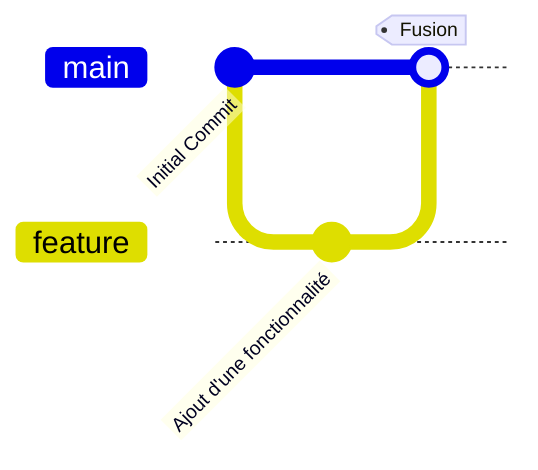

# Introduction à Git

Git est un système de gestion de versions distribué utilisé pour suivre les modifications du code source. Il permet de travailler en collaboration et de gérer différentes versions d'un projet.

## Installation de Git

- Windows : Télécharger et installer depuis [git-scm.com](https://git-scm.com/downloads/win)
- Linux : `sudo apt install git`

Vérifier l'installation avec :
```sh
$ git --version
```

## Configuration de Git
Avant d'utiliser Git, configurez votre identité :
```sh
git config --global user.name "Votre Nom"
git config --global user.email "votre.email@example.com"
```

## Commandes de base

### Initialiser un dépôt
Avant d'initier un dépôt, il faut créer un nouveau dossier dans lequel on créera notre futur projet.
```sh
git init
```
Crée un nouveau dépôt Git dans le dossier actuel.

### Cloner un dépôt
```sh
git clone <url_du_dépôt>
```
Télécharge une copie du dépôt distant.

### Ajouter des fichiers à l'index
```sh
git add <fichier>
```
Ajoute un fichier à la prochaine validation.

### Valider les modifications
```sh
git commit -m "Message de commit"
```
Enregistre les modifications dans l'historique du dépôt. On appel ça un `commit`.

### Afficher l'état du dépôt
```sh
git status
```
Montre les fichiers modifiés, ajoutés et en attente de validation.

### Afficher l'historique des commits
```sh
git log --oneline --graph --decorate --all
```
Affiche un historique compact avec la structure des branches.

## Gestion des branches

### Créer une branche
```sh
git branch <nom_de_branche>
```
Crée une nouvelle branche.

### Changer de branche
```sh
git checkout <nom_de_branche>
```
Ou, en version récente  :
```sh
git switch <nom_de_branche>
```

### Fusionner une branche
```sh
git merge <nom_de_branche>
```
Fusionne `<nom_de_branche>` dans la branche actuelle. Cela permet de rapatrier les modifications apportées dans une branche.

### Schéma des branches


## Travailler avec un dépôt distant

### Lier un dépôt distant
```sh
git remote add origin <url_du_dépôt>
```

### Envoyer les modifications
```sh
git push origin <nom_de_branche>
```
Ou si vous ne voulez pas spécifier la branche : 

```sh
git push 
```


### Récupérer les mises à jour
```sh
git pull origin <nom_de_branche>
```
Ou si vous ne voulez pas spécifier la branche : 
```sh
git pull 
```

## Résolution de conflits
En cas de conflits lors d'une fusion, Git demande de modifier les fichiers conflictuels, puis :
```sh
git add <fichier_conflit>
git commit -m "Résolution de conflit"
```

