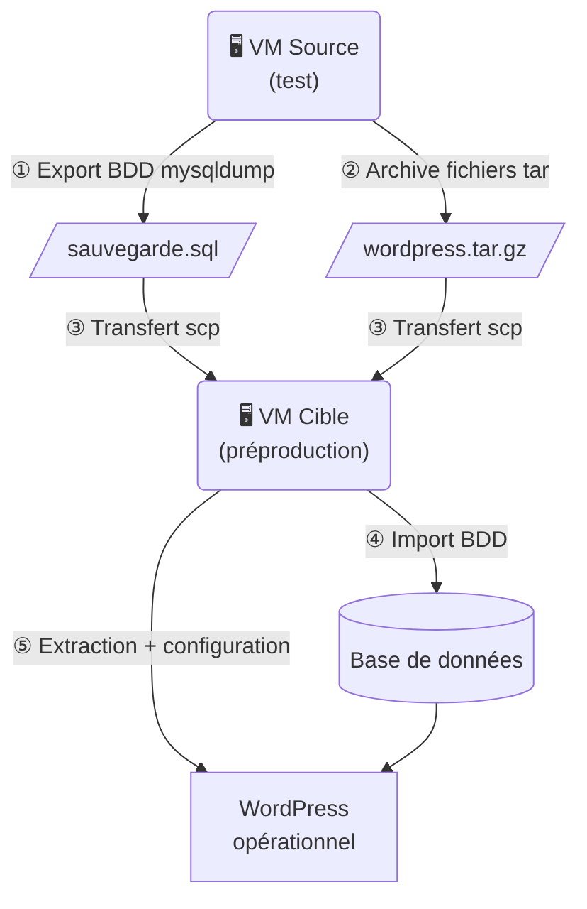

# 🔄 MÉMO – Migration WordPress entre deux VMs

Ce mémo décrit la démarche complète pour migrer un site WordPress d'une VM source (ex : test) vers une VM cible (ex : préproduction), **sans plugin**.

---

## Vue d'ensemble



La migration se décompose en **5 grandes étapes** :

| Étape | Action |
|---|---|
| 1 | Exporter la base de données |
| 2 | Archiver les fichiers WordPress |
| 3 | Transférer vers la VM cible |
| 4 | Restaurer la base de données |
| 5 | Configurer WordPress sur la VM cible |

---

## Étape 1 – Exporter la base de données

Sur la **VM source**, exporter la base de données MySQL/MariaDB avec `mysqldump`.

```bash
mysqldump -u root -p nom_de_la_bdd > sauvegarde_wordpress.sql
```

::: tip Retrouver le nom de la base
Le nom de la base de données se trouve dans le fichier `wp-config.php` du site :
```bash
grep "DB_NAME" /var/www/html/wordpress/wp-config.php
```
:::

::: warning Vérification
Ouvrez le fichier `.sql` généré et vérifiez qu'il contient bien des instructions `CREATE TABLE` et `INSERT INTO`. Un fichier vide ou trop petit indique un problème d'export.
:::

---

## Étape 2 – Archiver les fichiers WordPress

Toujours sur la **VM source**, créer une archive du dossier WordPress.

```bash
cd /var/www/html
tar -czf wordpress_sauvegarde.tar.gz wordpress/
```

::: tip Où se trouve WordPress ?
Par défaut avec LAMP, WordPress est dans `/var/www/html/`. Adaptez le chemin si votre installation est différente.
:::

---

## Étape 3 – Transférer les fichiers vers la VM cible

Plusieurs méthodes sont possibles selon votre infrastructure.

::: code-group

```bash [SCP (réseau)]
# Depuis la VM source, envoyer vers la VM cible
scp sauvegarde_wordpress.sql utilisateur@IP_VM_CIBLE:/home/utilisateur/
scp wordpress_sauvegarde.tar.gz utilisateur@IP_VM_CIBLE:/home/utilisateur/
```

```bash [Clé USB / dossier partagé]
# Copier les fichiers vers le point de montage
cp sauvegarde_wordpress.sql /media/usb/
cp wordpress_sauvegarde.tar.gz /media/usb/
```

:::

::: warning Droits SSH
Pour utiliser `scp`, le service SSH doit être actif sur la VM cible :
```bash
sudo systemctl status ssh
sudo systemctl start ssh   # si nécessaire
```
:::

---

## Étape 4 – Restaurer la base de données

Sur la **VM cible**, créer une nouvelle base de données et y importer le fichier `.sql`.

### 4.1 Créer la base de données

```bash
mysql -u root -p
```

```sql
CREATE DATABASE nom_de_la_bdd CHARACTER SET utf8mb4 COLLATE utf8mb4_unicode_ci;
CREATE USER 'wp_user'@'localhost' IDENTIFIED BY 'mot_de_passe';
GRANT ALL PRIVILEGES ON nom_de_la_bdd.* TO 'wp_user'@'localhost';
FLUSH PRIVILEGES;
EXIT;
```

### 4.2 Importer le dump SQL

```bash
mysql -u root -p nom_de_la_bdd < /home/utilisateur/sauvegarde_wordpress.sql
```

::: tip Vérification rapide
```bash
mysql -u root -p -e "USE nom_de_la_bdd; SHOW TABLES;"
```
Vous devez voir la liste des tables WordPress (`wp_posts`, `wp_users`, etc.).
:::

---

## Étape 5 – Déployer WordPress sur la VM cible

### 5.1 Extraire l'archive

```bash
cd /var/www/html
sudo tar -xzf /home/utilisateur/wordpress_sauvegarde.tar.gz
sudo chown -R www-data:www-data wordpress/
sudo chmod -R 755 wordpress/
```

### 5.2 Mettre à jour wp-config.php

Éditer le fichier de configuration pour pointer vers la nouvelle base de données :

```bash
sudo nano /var/www/html/wordpress/wp-config.php
```

Modifier les lignes suivantes :

```php
define( 'DB_NAME',     'nom_de_la_bdd' );   // Nom de la BDD sur la VM cible
define( 'DB_USER',     'wp_user' );          // Utilisateur créé à l'étape 4
define( 'DB_PASSWORD', 'mot_de_passe' );     // Mot de passe correspondant
define( 'DB_HOST',     'localhost' );        // Ne pas modifier
```

### 5.3 Mettre à jour les URLs en base de données

Les URLs de l'ancien site sont stockées en base. Il faut les remplacer par celles de la VM cible.

```bash
mysql -u root -p nom_de_la_bdd
```

```sql
-- Remplacer l'ancienne URL par la nouvelle
UPDATE wp_options SET option_value = 'http://IP_VM_CIBLE'
  WHERE option_name = 'siteurl';

UPDATE wp_options SET option_value = 'http://IP_VM_CIBLE'
  WHERE option_name = 'home';
```

::: warning URLs dans le contenu
Si vos articles ou médias contiennent des liens absolus vers l'ancienne URL, ils doivent aussi être mis à jour :
```sql
UPDATE wp_posts SET post_content = REPLACE(post_content,
  'http://ANCIENNE_URL', 'http://IP_VM_CIBLE');
```
:::

### 5.4 Vérifier la configuration Apache

S'assurer qu'Apache pointe bien vers le dossier WordPress :

```bash
sudo nano /etc/apache2/sites-available/000-default.conf
```

```apache
<VirtualHost *:80>
    DocumentRoot /var/www/html/wordpress
    <Directory /var/www/html/wordpress>
        AllowOverride All
    </Directory>
</VirtualHost>
```

Activer `mod_rewrite` et redémarrer Apache :

```bash
sudo a2enmod rewrite
sudo systemctl restart apache2
```

---

## Vérification finale

Ouvrir un navigateur et accéder à `http://IP_VM_CIBLE`.

| Vérification | Résultat attendu |
|---|---|
| Page d'accueil du site | S'affiche correctement |
| Images et médias | Visibles (pas de liens cassés) |
| Back-office `/wp-admin` | Connexion fonctionnelle |
| Articles et pages | Contenu intact |

::: danger Problème de connexion au back-office ?
Si WordPress redirige en boucle ou affiche une erreur après connexion, vider les cookies du navigateur et vérifier que `siteurl` et `home` dans `wp_options` correspondent bien à l'IP de la VM cible.
:::

---

## Récapitulatif des commandes clés

```bash
# --- VM SOURCE ---
# Export BDD
mysqldump -u root -p nom_de_la_bdd > sauvegarde_wordpress.sql

# Archive fichiers
tar -czf wordpress_sauvegarde.tar.gz /var/www/html/wordpress/

# Transfert vers VM cible
scp sauvegarde_wordpress.sql utilisateur@IP_VM_CIBLE:/home/utilisateur/
scp wordpress_sauvegarde.tar.gz utilisateur@IP_VM_CIBLE:/home/utilisateur/

# --- VM CIBLE ---
# Créer la BDD et importer
mysql -u root -p nom_de_la_bdd < sauvegarde_wordpress.sql

# Extraire les fichiers
tar -xzf wordpress_sauvegarde.tar.gz -C /var/www/html/

# Droits
chown -R www-data:www-data /var/www/html/wordpress/

# Redémarrer Apache
systemctl restart apache2
```
