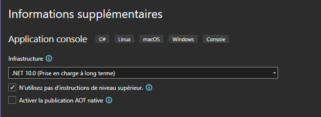

# TP 2 — Anatomie d'un programme C#

<Badge type="info" text="BTS SIO 1ère année" />  <Badge type="warning" text="Bloc 1 — Initiation C#" />  <Badge type="danger" text="Visual Studio 2022 · C#" />

::: info Contexte
Dans le TP 1, vous avez créé et exécuté votre premier programme — mais en utilisant le code généré automatiquement sans vraiment en comprendre la structure. Ce TP lève le voile : vous allez découvrir ce que contient vraiment un programme C#, apprendre à **stocker des informations dans des variables**, et créer vos premiers programmes **interactifs** — des programmes qui dialoguent avec l'utilisateur.
:::

::: warning Modalités
Ce TP se déroule **individuellement**. Vous devez remplir le **document de restitution** au fur et à mesure de la séance. Ce document est à déposer sur Moodle **avant la fin du TP**, au format **PDF**.

📥 <a href="/tp2-csharp-restitution.docx" download style="font-weight:600">Télécharger le document de restitution</a>

Les captures d'écran demandées 📸 sont à coller directement dans ce document.
:::

---

## Ce que vous allez apprendre

| Concept | Ce que c'est |
|---|---|
| **namespace / class / Main** | La structure cachée derrière chaque programme C# |
| **Variable** | Une « case mémoire » avec un nom et un type |
| **string** | Le type C# pour stocker du texte |
| **Console.ReadLine()** | Lire ce que l'utilisateur tape au clavier |
| **Interpolation** | Construire des messages dynamiques avec `$"Bonjour {prenom} !"` |

---

## Mission 1 — La structure d'un programme C#

### Tâche 1.1 — Créer un nouveau projet

Dans Visual Studio, cliquez sur **"Créer un projet"**, sélectionnez **Application console (C#)** et cliquez sur **Suivant**.

Renseignez les informations du projet :

| Champ | Valeur |
|---|---|
| Nom du projet | `ProgrammeInteractif` |
| Emplacement | Le dossier à votre nom sur le disque D |

Cliquez sur **Suivant**. Vous arrivez sur l'écran **"Informations supplémentaires"**.

### Tâche 1.2 — Désactiver les instructions de niveau supérieur

Sur l'écran "Informations supplémentaires", **cochez la case** :

> ✅ N'utilisez pas d'instructions de niveau supérieur


::: info Pourquoi cocher cette case ?
Par défaut, Visual Studio génère un code simplifié qui masque la vraie structure d'un programme C#. En cochant cette case, vous demandez à Visual Studio de générer la **structure complète et explicite** — celle que vous utiliserez tout au long du cours.
:::

Puis cliquez sur **Créer**.

### Tâche 1.3 — Explorer Program.cs

Ouvrez `Program.cs` dans l'Explorateur de solutions. Visual Studio a généré la structure complète :

```csharp
namespace ProgrammeInteractif
{
    internal class Program
    {
        static void Main(string[] args)
        {
            Console.WriteLine("Hello, World!");
        }
    }
}
```

Exécutez avec **Ctrl + F5** — `Hello, World!` s'affiche dans la console.

### Tâche 1.4 — Décortiquer la structure

---

**`namespace ProgrammeInteractif`**

Un espace de noms regroupe les classes liées entre elles — comme un dossier sur votre disque. Il évite les conflits de noms entre bibliothèques. Par convention, le namespace porte le nom du projet.

---

**`internal class Program`**

En C#, tout le code doit appartenir à une **classe**. Ici, `Program` est la classe principale. Le mot-clé `internal` indique que cette classe n'est accessible que depuis ce projet. Vous approfondirez les classes quand vous aborderez la **Programmation Orientée Objet** — pour l'instant, retenez qu'elles sont obligatoires.

---

**`static void Main(string[] args)`**

C'est le **point d'entrée** du programme — la porte par laquelle Windows commence l'exécution. Chaque programme C# possède exactement une méthode `Main`.

| Mot-clé | Signification |
|---|---|
| `static` | Appartient à la classe, pas à un objet |
| `void` | La méthode ne renvoie aucune valeur |
| `Main` | Nom réservé : l'exécution démarre ici |
| `string[] args` | Arguments en ligne de commande (ignorés pour l'instant) |

---

::: info Votre code va toujours ici
Dans la suite de ce TP, **tout le code que vous écrirez se place à l'intérieur des accolades de `Main`**, à la place du `Console.WriteLine("Hello, World!")` actuel. Ne modifiez pas le reste de la structure.
:::

::: tip 📸 Capture 1
Votre fichier `Program.cs` avec la structure complète (namespace, class, Main) visible dans l'éditeur.
:::

::: tip Document de restitution — Question 1
Complétez la **Question 1** dans votre document.
:::

---

## Mission 2 — Les variables

::: warning Rappel — où écrire votre code ?
Dans toutes les missions qui suivent, **écrivez votre code à l'intérieur de `static void Main(string[] args)`**, entre les deux accolades `{ }`. Les exemples ci-dessous ne montrent que le contenu de Main pour rester lisibles — la structure autour ne change pas.
:::

### Tâche 2.1 — Qu'est-ce qu'une variable ?

Imaginez une variable comme une **boîte étiquetée** dans la mémoire de l'ordinateur :
- Elle a un **nom** (l'étiquette) — pour y accéder
- Elle a un **type** (la forme de la boîte) — ce qu'on peut y mettre
- Elle contient une **valeur** (le contenu)

```csharp
//    type    nom        valeur
//    ↓       ↓          ↓
      string  prenom  =  "Lucie";
```

Le signe `=` n'est pas une égalité mathématique — c'est une **affectation** : "mets la valeur `"Lucie"` dans la boîte nommée `prenom`".

::: warning Guillemets obligatoires pour les chaînes
`"Lucie"` (avec guillemets) est une **valeur texte** que le programme stocke.

`Lucie` (sans guillemets) serait interprété comme le nom d'une autre variable — ce qui provoquerait une erreur si cette variable n'existe pas.
:::

### Tâche 2.2 — Déclarer et utiliser une variable string

**`string`** est le type C# pour les chaînes de caractères (du texte). Remplacez le contenu de `Program.cs` par :

```csharp
string prenom = "Lucie";
Console.WriteLine(prenom);
```

Exécutez avec **Ctrl + F5**. La console affiche `Lucie`.

Maintenant, modifiez le programme pour changer la valeur :

```csharp
string prenom = "Lucie";
Console.WriteLine(prenom);

prenom = "Thomas";
Console.WriteLine(prenom);
```

Exécutez. La **même variable** affiche deux valeurs différentes — parce qu'on a modifié son contenu entre les deux affichages.

### Tâche 2.3 — Conventions de nommage

En C#, les noms de variables suivent des règles précises :

| Règle | Exemple correct | Exemple incorrect |
|---|---|---|
| Commence par une lettre | `prenom`, `age` | `1valeur` |
| Pas d'espace | `nomComplet` | `nom complet` |
| Sensible à la casse | `prenom` ≠ `Prenom` | — |
| Utiliser le **camelCase** | `dateDeNaissance` | `DateDeNaissance` |
| Nom explicite | `nombreEleves` | `n` |

::: warning À ne pas faire
```csharp
string 1valeur = "test";   // ❌ commence par un chiffre
string mon nom = "...";    // ❌ contient un espace
string string = "...";     // ❌ string est un mot réservé
```
:::

::: tip Document de restitution — Question 2
Complétez la **Question 2** dans votre document.
:::

---

## Mission 3 — Lire une saisie au clavier

### Tâche 3.1 — Console.ReadLine()

Jusqu'à présent, vos programmes affichaient des informations **codées en dur** dans le code source. Pour rendre un programme vraiment utile, il faut qu'il puisse **lire ce que l'utilisateur tape**.

`Console.ReadLine()` :
1. **Arrête** l'exécution du programme
2. **Attend** que l'utilisateur tape quelque chose et appuie sur Entrée
3. **Renvoie** le texte saisi sous forme de `string`

Le résultat doit être stocké dans une variable pour pouvoir l'utiliser ensuite.

### Tâche 3.2 — Premier programme interactif

Remplacez le contenu de `Program.cs` par :

```csharp
Console.Write("Quel est votre prénom ? ");
string prenom = Console.ReadLine();
Console.WriteLine("Bonjour " + prenom + " !");
```

::: info Pourquoi Console.Write et non Console.WriteLine ?
`Console.Write` n'ajoute pas de retour à la ligne après le message. Ainsi, le curseur reste sur la même ligne et l'utilisateur tape directement après la question — c'est plus naturel visuellement.
:::

Exécutez, tapez votre prénom, appuyez sur Entrée.

::: tip 📸 Capture 2
La console affichant la question et le message de bienvenue personnalisé avec votre prénom.
:::

### Tâche 3.3 — Poser plusieurs questions

Il est possible de lire plusieurs informations en enchaînant les `Console.ReadLine()` :

```csharp
Console.Write("Votre prénom : ");
string prenom = Console.ReadLine();

Console.Write("Votre ville : ");
string ville = Console.ReadLine();

Console.Write("Votre sport favori : ");
string sport = Console.ReadLine();

Console.WriteLine("--- Résumé ---");
Console.WriteLine("Prénom : " + prenom);
Console.WriteLine("Ville  : " + ville);
Console.WriteLine("Sport  : " + sport);
```

Chaque `Console.ReadLine()` capture une nouvelle saisie dans une **nouvelle variable distincte**.

::: tip Document de restitution — Question 3
Complétez la **Question 3** dans votre document.
:::

---

## Mission 4 — Construire des messages dynamiques

### Tâche 4.1 — La concaténation avec `+`

Vous avez déjà utilisé `+` pour assembler des chaînes :

```csharp
string prenom = "Lucie";
string message = "Bonjour " + prenom + " ! Bienvenue en BTS SIO.";
Console.WriteLine(message);
```

Chaque `+` « colle » deux chaînes bout à bout. Ça fonctionne, mais avec plusieurs variables ça devient vite difficile à relire.

### Tâche 4.2 — L'interpolation de chaînes

C# propose une syntaxe plus lisible : l'**interpolation de chaînes**. Il suffit de placer un `$` devant les guillemets ouvrants, et d'insérer les variables directement entre `{ }` :

```csharp
string prenom = "Lucie";
string ville = "Colmar";

Console.WriteLine($"Bonjour {prenom} ! Tu habites à {ville}.");
```

Le `$` indique à C# que la chaîne contient des expressions à évaluer. Tout ce qui est entre `{ }` est remplacé par sa valeur au moment de l'exécution.

### Tâche 4.3 — Comparaison des deux approches

Testez les deux versions et observez que le résultat est identique :

```csharp
string prenom = "Lucie";
string ville = "Colmar";

// Concaténation
Console.WriteLine("Bonjour " + prenom + " ! Tu habites à " + ville + ".");

// Interpolation
Console.WriteLine($"Bonjour {prenom} ! Tu habites à {ville}.");
```

::: info Laquelle choisir ?
**L'interpolation est recommandée** : le code ressemble davantage au message final, ce qui le rend plus facile à lire et à corriger. Vous utiliserez cette syntaxe dans la suite du cours.
:::

Réécrivez maintenant le programme de la tâche 3.3 en remplaçant la concaténation par l'interpolation dans toutes les lignes `Console.WriteLine`.

::: tip 📸 Capture 3
Le résumé du programme (prénom, ville, sport) affiché en console, construit avec l'interpolation de chaînes.
:::

::: tip Document de restitution — Question 4
Complétez la **Question 4** dans votre document.
:::

---

## Mission 5 — Exercices de consolidation

### Exercice 1 — Présentation personnelle

Créez un programme qui pose ces questions à l'utilisateur :

1. Son prénom
2. Son nom de famille
3. Sa classe (ex : `BTS SIO 1`)

Puis affiche une phrase de présentation. Exemple de résultat attendu :

```
Bonjour, je m'appelle Lucie MARTIN et je suis en BTS SIO 1.
Bienvenue au Lycée Camille Sée, Colmar !
```

Utilisez l'interpolation de chaînes pour construire le message.

::: tip 📸 Capture 4
Votre programme de présentation en cours d'exécution dans la console.
:::

### Exercice 2 — Fiche de contact

Créez un programme qui demande à l'utilisateur :

- Son prénom et son nom
- Son adresse e-mail
- Sa ville

Puis affiche une fiche formatée. Exemple de résultat attendu :

```
╔══════════════════════════════════╗
║         FICHE DE CONTACT         ║
╠══════════════════════════════════╣
║  Nom    : Lucie MARTIN           ║
║  Email  : lucie.martin@email.fr  ║
║  Ville  : Colmar                 ║
╚══════════════════════════════════╝
```

::: tip Caractères de bordure
Copiez-collez ces caractères directement dans votre code : `╔ ╗ ║ ╠ ╣ ╚ ╝ ═`
:::

::: tip 📸 Capture 5
Votre fiche de contact affichée dans la console avec les données saisies.
:::

### Exercice 3 — Billet de train

Créez un programme qui demande à l'utilisateur :

- La ville de départ
- La ville d'arrivée
- Le nom du passager
- La date du voyage

Puis affiche un billet formaté dans la console :

```
══════════════════════════════════════════
           🚂 BILLET DE TRAIN
══════════════════════════════════════════
  Passager : Lucie MARTIN
  De       : Colmar
  À        : Paris
  Date     : 15 septembre 2026
══════════════════════════════════════════
```

::: tip Astuce
Utilisez `Console.WriteLine("══════...")`  pour les séparateurs — copiez-collez le caractère `═` autant de fois que nécessaire.
:::

::: tip 📸 Capture 6
Votre billet de train affiché dans la console avec les informations saisies.
:::

### Exercice 4 — Générateur d'histoire

Créez un programme qui demande 5 informations à l'utilisateur, puis génère une histoire courte en les insérant :

1. Le prénom d'un héros
2. Une ville
3. Un animal
4. Une couleur
5. Un objet mystérieux

Exemple de résultat attendu (avec les saisies `Lucie`, `Strasbourg`, `renard`, `violet`, `parapluie`) :

```
══════════════════════════════════════════════════
                  VOTRE HISTOIRE
══════════════════════════════════════════════════

Par un beau matin, Lucie se promenait dans les rues de Strasbourg.
Soudain, Lucie croisa un étrange renard violet
qui portait fièrement un parapluie.
Personne ne sut jamais comment cette aventure se termina...

══════════════════════════════════════════════════
```

::: info Remarque
Le texte ne sera pas parfaitement aligné pour des saisies très courtes ou très longues — c'est normal. Vous découvrirez plus tard comment formater précisément la largeur des chaînes. Pour l'instant, l'important est que l'histoire s'affiche avec les bonnes informations.
:::

::: tip 📸 Capture 7
Votre générateur d'histoire avec vos propres mots.
:::

---

## Rendu

::: danger Rendu sur Moodle
Déposez votre **document de restitution complété au format PDF** sur Moodle avant la fin de la séance. Il doit contenir les réponses aux 4 questions et les 7 captures d'écran demandées.
:::
