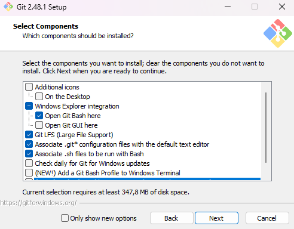
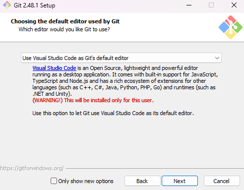
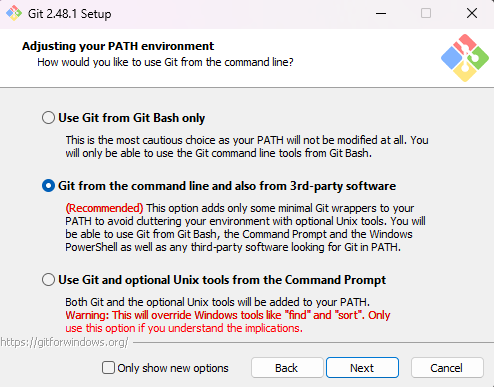
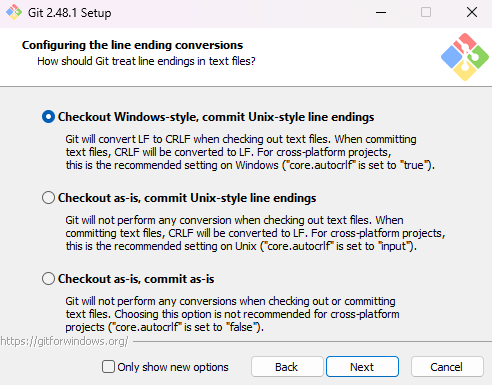
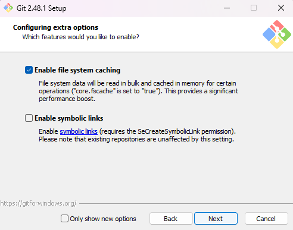
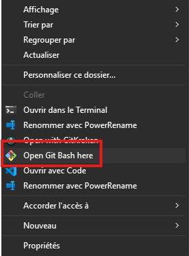

# 📝 **TP 01 - Découverte de Git et Github**  

## **🎯 Objectifs**  
✔ Apprendre à initialiser un dépôt Git localement.
✔ Savoir stager, committer et visualiser l’hisstorique des modifications.
✔ Expérimenter les branches et les merges.


## 🔧 Etape 1 : Téléchargement et configuration de Git
### Installation de Git

- Windows : Télécharger et installer depuis [git-scm.com](https://git-scm.com/downloads/win)
- Linux : `sudo apt install git`

::: details ℹ️ Aide d'installation
### Suivez ces étapes pour installer correctement Git
Après avoir téléchargé Git, vous avez un ensemble de configurations à réaliser.


---

Sur cet écran, vous pouvez sélectionner l'éditeur de texte par défaut que vous voulez utiliser pour la correction des conflits.
Vous pouvez sélectionner celui que vous souhaitez, mais je vous recommande `VSCode` qui est très performant pour faire de la correction de conflit.



---

Ici on garde le choix recommandé : 


---

Pour cette page on garde le choix 1, cela nous permet d'utiliser OpenSSH fournis avec l'installation de Git.


---

On garde le choix par défaut.


---



---

Ici on utilisera MinTTY


---

Séléction du choix par défaut : 


---


---



---

Il ne vous reste plus qu'a ouvrir  `git Bash`.
Cela permet d'ouvrir une invite de commande qui vous permettra d'utiliser les commandes Linux. 


:::

Vérifier l'installation avec :
```sh
$ git --version
```

### Configuration de Git
Avant d'utiliser Git, configurez votre identité :
```sh
git config --global user.name "Votre Nom"
git config --global user.email "votre.email@example.com"
```

Vous êtes à présent prêt pour utiliser Git dans des bonnes conditions.

## 🔧 Etape 2 : Initialisation d'un dépôt et les premiers commits

#### 🔃 **Initialiser** un dépôt Git

1. **Ouvrir un terminal** sur votre machine.  
2. Créer un nouveau dossier pour votre projet :  
   ```bash
   mkdir mon-projet-git
   cd mon-projet-git
   ```
3. **Initialiser** un dépôt Git dans ce dossier :  
   ```bash
   git init
   ```

---

#### 📂 **Ajouter** un fichier et faire un premier commit 
1. **Créer un fichier `index.html`** dans le dossier et ajouter la structure de base :  
2. Vérifier l’état du dépô :  
   ```bash
   git status
   ```
   👉 Que remarquez-vous ?  

3. Ajouter le fichier dans la zone de staging  
4. Créer un premier commit 
5. Vérifier que le commit a bien été enregistré
   
::: details ℹ️ Aide
   ```bash
   git add index.html
   git commit -m "Ajout du fichier .html"
   ```
   👉 Vérifiez que le commit a bien été enregistré avec :  
   ```bash
   git log --oneline
   ```
:::
---

#### ✏️ **Modifier** un fichier et faire un second commit
1. **Modifier** le fichier `index.html` en ajoutant un titre `<h1>` sur votre page :  
2. **Vérifier** les modifications 
3. **Ajouter** et committer les changements avec un message qui indique ce que vous avez fait.
4. **Consulter**  l’historique des commits :  
 


## **🌿 Étape 3 : Créer et naviguer entre les branches**  
1. **Créer**  une nouvelle branche appelée `develop`
2. **Vérifier** les branches existantes 
   👉 La branche actuelle est marquée avec un `*`.  

3. **Se déplacer** sur la branche `develop`
  
::: details ℹ️ Aide
   ```bash
   git branch develop
   git branch
   git switch dev
   ```
:::
  

## **📝 Étape 4 : Modifier un fichier sur une branche sans impacter les autres**  
1. **Modifier** le fichier `index.html` sur la branche `develop`
2. **Commiter** ces modifications 


## **👀 Étape 5 : Observer l’indépendance des branches**  
1. **Retourner** sur la branche `main`  
2. **Afficher** le contenu du fichier `index.html`  
   👉 Que constatez-vous ? 

3. **Repasser** sur `develop` et revérifier le fichier `index.html`  
   👉 Les modifications sont bien spécifiques à chaque branche !   


## **🔄 Étape 6 : Fusionner la branche `develop` dans `main`**  
1. **Retourner** sur la branche `main` 
2. **Fusionner / Merger** la branche `develop` dans la branche `main`
3. **Vérifier**  le contenu de `index.html`  

👉 Les modifications de `develop` ont bien été ajoutées à `main` !
::: details ℹ️ Aide
   ```bash
      git switch main
      git merge develop
   ```
:::

## **⚠️ Étape 7 : Gérer un conflit lors d’une fusion**  
Dans cette partie, on va **provoquer un conflit Git** pour comprendre comment le résoudre.  
Sachez qu'un conflit n'est pas forcément grave. Il s'agit uniquement de prendre une décision que Git ne peux pas prendre à notre place.

1. **Sur la branche `main`**, modifier `index.html` pour ajouter un titre `<h2>`. N'oubliez pas de commit après votre modification.
   
2. **Sur la branche `develop`**, modifier aussi `index.html` à la même ligne pour mettre un paragraphe `<p>`. Faites un commit de votre modificiation.
3. **Retourner sur `main`** et essayer de fusionner `develop` :  
   ```bash
   git switch main
   git merge develop
   ```
   👉 Un **conflit** va apparaître !  

4. **Ouvrez `index.html`** avec `VSCode` et observer les marqueurs de conflit :  
   (`<<<<<<<`, `=======`, `>>>>>>>`).  

   Exemple de ce que vous pourriez voir :  
   ```html
   <h1>Je suis un titre h1 initialement écrit.<h1>
   <<<<<<< main
   <h2>Je suis un titre sur la branche main<h2>
   =======
   <p>Je suis un paragraphe dans la branche develop<p>
   >>>>>>> develop
   ```
5. **Résoudre le conflit** en choisissant **quelle modification conserver**.  
   Par exemple, modifiez le fichier pour qu’il ai la balise `<h1>` `<h2>` `<p>` :  
   ```html
   <h1>Je suis un titre h1 initialement écrit.<h1>
   <h2>Je suis un titre sur la branche main<h2>
   <p>Je suis un paragraphe dans la branche develop<p>
   ```
6. **Ajouter et valider les modifications** :  
   ```bash
   git add index.html
   git commit -m "Résolution du conflit entre main et develop"
   ```
7. **Vérifier que tout est bien fusionné** :  
   ```bash
   git log --oneline 
   ```
