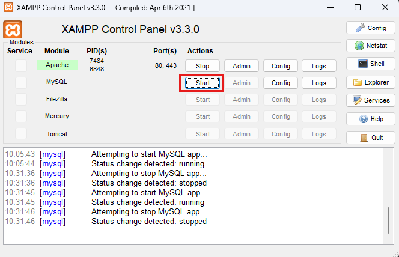
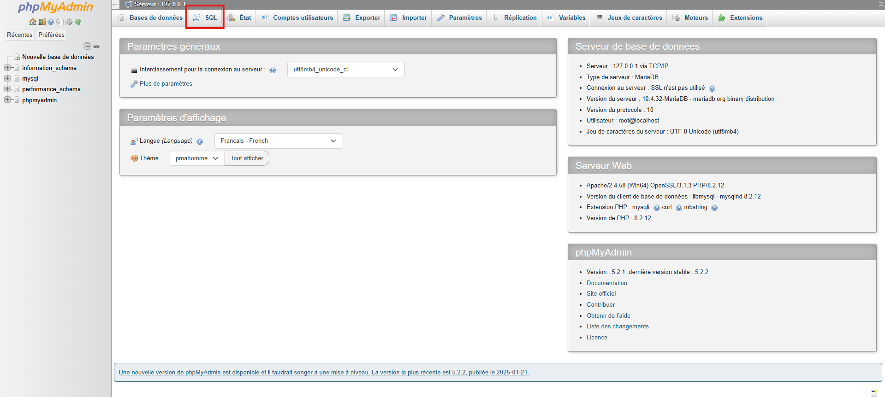
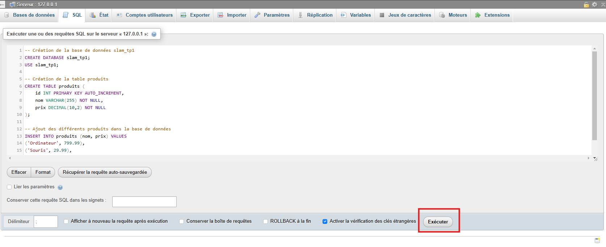

### 📝 **TP : Manipulation de PDO en PHP**  

#### **🎯 Objectifs**  
✔ Comprendre et utiliser **PDO** pour interagir avec une base de données MySQL.  
✔ Savoir **se connecter** à une base de données avec PDO.  
✔ Être capable de **récupérer** des données et de les afficher.  
✔ Apprendre à **ajouter** et **supprimer** des éléments dans une table.  
✔ En bonus : Modifier un élément existant.  


## Exercice 1 : Préparation de la base de données

Avant de commencer, nous devons créer une base de données. Pour cette partie il va falloir utiliser le SGBDR `MySql` et l'administrer via `phpMyAdmin`.

Pour lancer `MySql` c'est très simple, il faut retourner sur Xampp et cliquer sur le bouton start :
 


Une fois lancé, vous pouvez cliquer sur le bouton juste à côté : `Admin`

Cela vous redirige vers l'interface de `phpMyAdmin`. 



Il ne vous reste plus qu'à cliquer sur l'onglet `SQL` et d'exécuter le script ci-dessous qui va vous permettre de créer une base de données `slam_tp1`, une table `produits`, et d'y insérer 3 produits :  

```sql
-- Création de la base de données slam_tp1
CREATE DATABASE slam_tp1;
USE slam_tp1;

-- Création de la table produits
CREATE TABLE produits (
    id INT PRIMARY KEY AUTO_INCREMENT,
    nom VARCHAR(255) NOT NULL,
    prix DECIMAL(10,2) NOT NULL
);

-- Ajout des différents produits dans la base de données
INSERT INTO produits (nom, prix) VALUES
('Ordinateur', 799.99),
('Souris', 29.99),
('Clavier', 49.99);
```




Dès que vous avez créé votre nouvelle base de données, vous pouvez passer à la suite.

## Exercice 2 : Connexion à la base de données avec PDO

1. **Créez un fichier `config.php`** qui contiendra les informations de connexion.  
2. Dans ce fichier, utilisez **PDO** pour établir la connexion.  
3. Affichez un message en cas d'erreur.  

👉 **Instructions :**  
- Déclarez les constantes **DB_HOST**, **DB_NAME**, **DB_USER** et **DB_PASS**.  
- Utilisez `try...catch` pour gérer les erreurs de connexion.  

---

## Exercice 3 : Affichage des éléments de la base de données

1. Créez un fichier `index.php`.  
2. Dans ce fichier :  
   - Incluez `config.php` pour utiliser la connexion PDO.  
   - Récupérez tous les produits de la table **produits** avec une requête SQL (`SELECT * FROM produits`).  
   - Affichez ces produits sous forme de liste ou de tableau HTML.  

👉 **Exemple de sortie attendue :**  

| ID  | Nom         | Prix (€) |
|-----|------------|----------|
| 1   | Ordinateur | 799.99   |
| 2   | Souris     | 29.99    |
| 3   | Clavier    | 49.99    |

---

## Exercice 4 : Ajout d’un nouvel élément dans la base de données

1. Créez un fichier `ajout.php`.  
2. Ajoutez un **formulaire** avec :  
   - Un champ texte pour le **nom du produit**.  
   - Un champ nombre pour le **prix**.  
   - Un bouton **"Ajouter"**.  
3. Lorsque l’utilisateur valide le formulaire :  
   - Récupérez les données envoyées avec `$_POST`.  
   - Insérez ces données dans la base avec une requête préparée (`INSERT INTO produits`).  
   - Redirigez l’utilisateur vers `index.php` avec `header("Location: index.php")`.  

---

## Exercice 5 : Suppression d’un élément 

1. Ajoutez un **lien "Supprimer"** à côté de chaque produit dans `index.php`.  
2. Ce lien doit pointer vers `supprimer.php?id=ID_PRODUIT`.  
3. Dans `supprimer.php` :  
   - Vérifiez si un `id` est passé en paramètre.  
   - Exécutez une requête SQL pour **supprimer** l’élément (`DELETE FROM produits WHERE id = ?`).  
   - Redirigez l’utilisateur vers `index.php`.  

---

## Bonus : Modification d’un élément

1. Ajoutez un lien **"Modifier"** à côté de chaque produit, qui envoie vers `modifier.php?id=ID_PRODUIT`.  
2. Dans `modifier.php` :  
   - Affichez un **formulaire pré-rempli** avec les informations actuelles du produit.  
   - Lorsqu’on valide, mettez à jour l’élément dans la base (`UPDATE produits SET nom=?, prix=? WHERE id=?`).  
   - Redirigez l’utilisateur vers `index.php`.  

