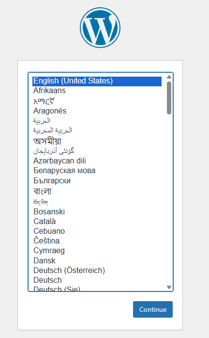
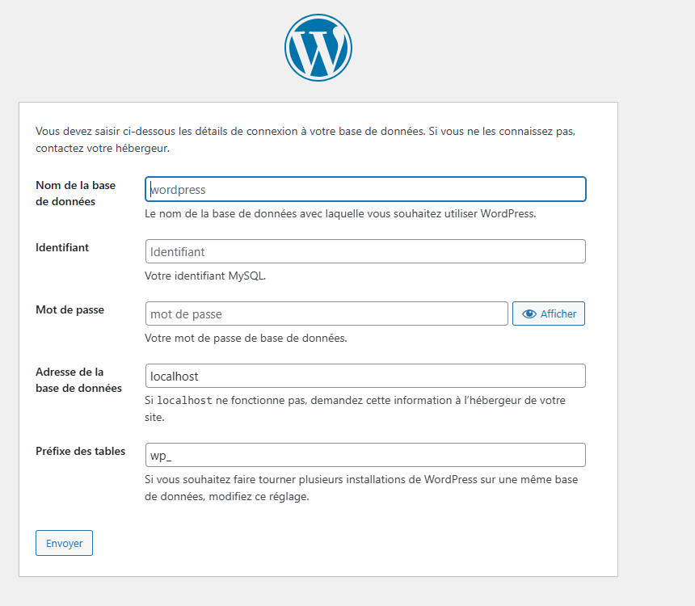
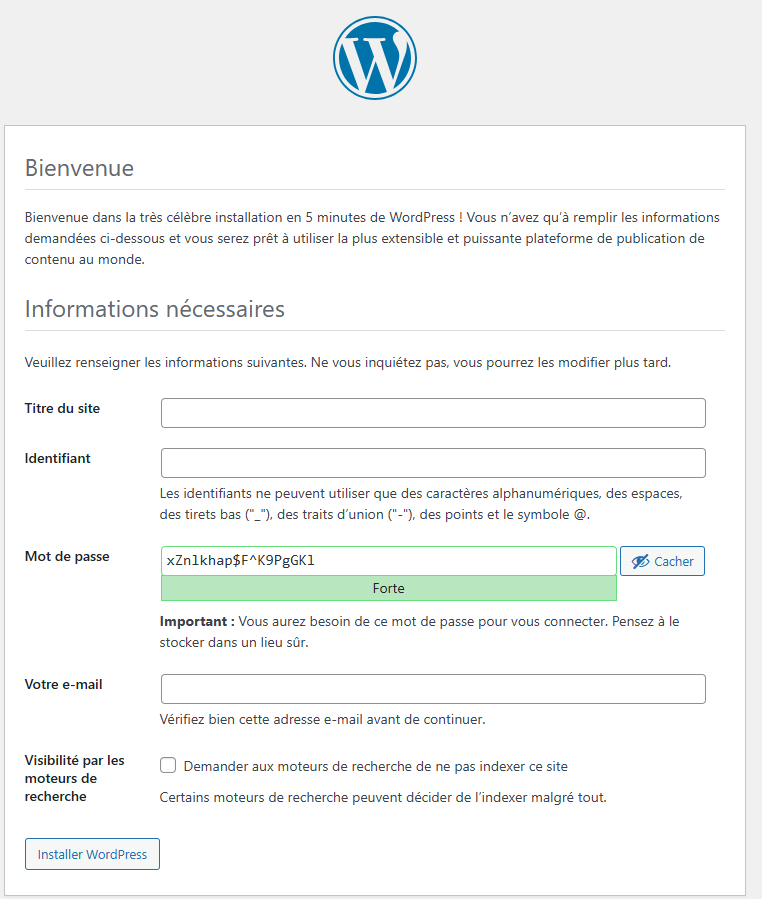
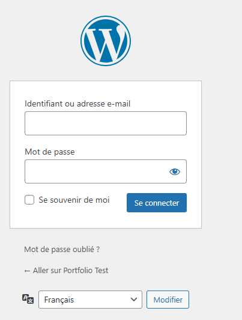
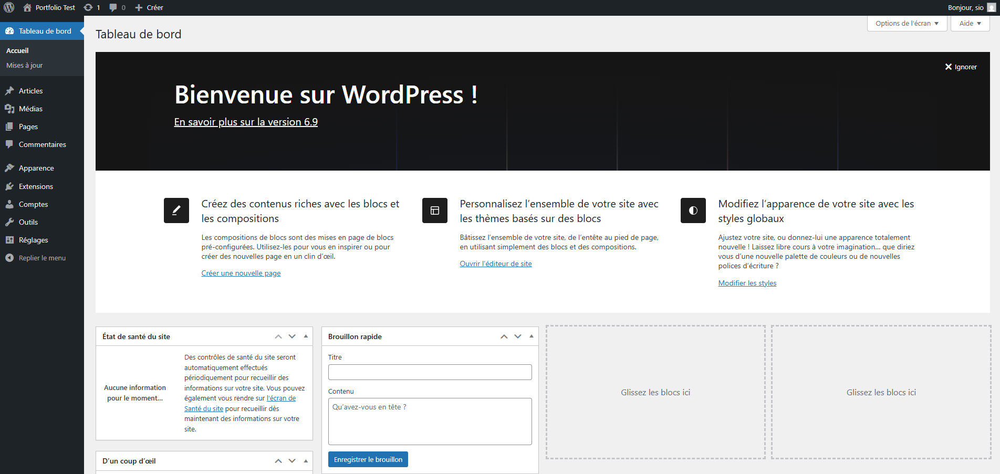
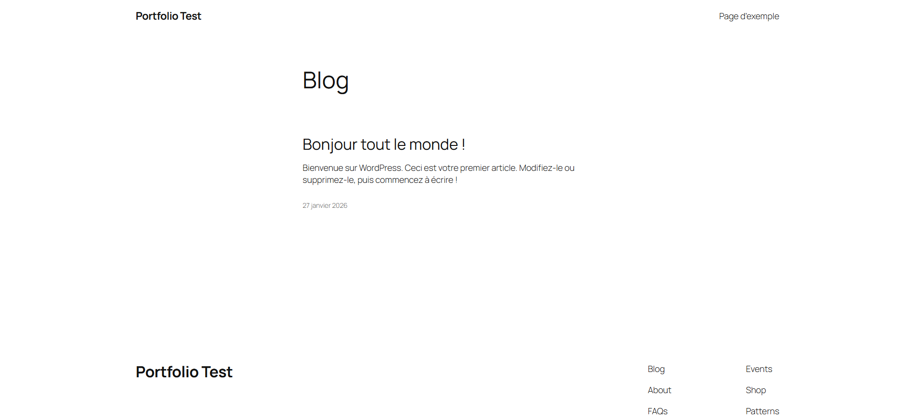
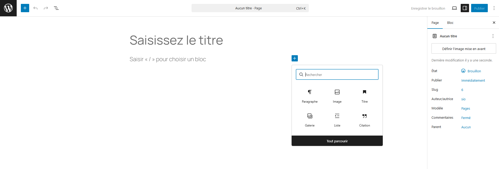
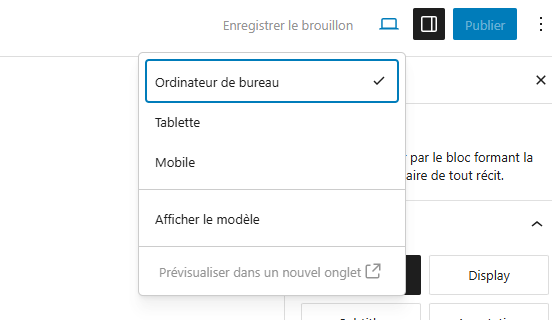

# 📝 TP : Déploiement d'une infrastructure Web LAMP & WordPress
###  🎯 Objectif : Installer un serveur LAMP pour héberger un CMS WordPress.

## Mise en place de LAMP
### 1. Préparation du système
Avant toute installation, on s'assure que les dépôts et les paquets sont à jour.

```Bash
apt update && apt upgrade -y
```

Installez directement `ssh`, cela va vous permettre d'accéder à votre machine virtuelle depuis votre ordinateur. N'hésitez pas à changer le port par défaut.

Nous allons aussi directement installer le pare-feu `UFW`.
Autorisez uniquement le port que vous avez ouvert pour votre connexion `ssh` ainsi que le port pour le protocole `http`

### 2. Installation du serveur Web (Apache2)
Apache est le serveur HTTP le plus utilisé. On l'installe de manière minimaliste.

```Bash
apt install apache2 -y
```
Vérification : Tapez l'adresse IP de la VM dans un navigateur. Vous devriez voir la page "Apache2 Debian Default Page".


### 3. Installation de la base de données (MariaDB)
On privilégie MariaDB (fork communautaire de MySQL), standard sous Debian.

```Bash
apt install mariadb-server -y
```

### 4. Installation de PHP (Le moteur)
WordPress nécessite PHP et des extensions spécifiques pour fonctionner (gestion d'images, de la base de données, etc.).

```Bash
apt install php php-mysql php-curl php-gd php-intl php-mbstring php-soap php-xml php-xmlrpc php-zip libapache2-mod-php -y
```
Redémarrage d'Apache : Pour prendre en compte PHP.

```Bash
systemctl restart apache2
```
### 5. Création de la base de données pour WordPress
On ne se connecte jamais à WordPress avec le compte "root" de la base de données. On crée un utilisateur dédié.

Connectez-vous à MariaDB : `mysql -u root -p` puis exécutez ces requêtes :

```SQL

-- Création de la base
CREATE DATABASE wordpress_db DEFAULT CHARACTER SET utf8mb4 COLLATE utf8mb4_unicode_ci;

-- Création de l'utilisateur dédié - Vous devez changer le mot de passe.
CREATE USER 'wp_user'@'localhost' IDENTIFIED BY 'TonMotDePasseTresSecurise-AChanger';

-- Attribution des droits
GRANT ALL PRIVILEGES ON wordpress_db.* TO 'wp_user'@'localhost';

-- Application et sortie
FLUSH PRIVILEGES;
EXIT;
```
### 6. Installation de WordPress
On télécharge la dernière version depuis les sources officielles.

Récupération :

```Bash
cd /tmp
wget https://wordpress.org/latest.tar.gz
tar -xzvf latest.tar.gz
```
:::tip ❓Question
Que permet de faire la commande `wget` ?  
Quel est l'intérêt de la commande `tar -xzvf` ?
:::

Déplacement vers le répertoire Web :

```Bash
rm -rf /var/www/html/*
cp -r wordpress/* /var/www/html/
```

Gestion des permissions (Crucial) : L'utilisateur qui fait tourner Apache (www-data) doit être propriétaire des fichiers pour permettre les mises à jour et l'upload d'images.

```Bash
chown -R www-data:www-data /var/www/html/
chmod -R 755 /var/www/html/
```

:::tip ❓Question
Présentez l'utilisateur `www-data`. Pourquoi c'est à lui qu'il faut donner les droits ?
:::
### 7. Configuration de l'Hôte Virtuel (VirtualHost)
Pour faire les choses proprement, on crée un fichier de configuration Apache dédié.

Désactiver le site par défaut : `a2dissite 000-default.conf`

Créer `/etc/apache2/sites-available/wordpress.conf` :

```Apache

<VirtualHost *:80>
    ServerAdmin admin@votre-domaine.lan
    DocumentRoot /var/www/html/
    <Directory /var/www/html/>
        AllowOverride All
    </Directory>
    ErrorLog ${APACHE_LOG_DIR}/error.log
    CustomLog ${APACHE_LOG_DIR}/access.log combined
</VirtualHost>
```
:::tip ❓Question
A quoi sert le fichier de configuration présent dans le dossier `sites-available` ?  
Expliquez chaque ligne présent dans le fichier `wordpress.conf`
:::

Activer le site et le module de réécriture (pour les liens WordPress) :

```Bash
a2ensite wordpress.conf
a2enmod rewrite
systemctl restart apache2
```

## Configuration de Wordpress

Accédez à votre serveur web depuis un navigateur, vous devriez avoir cette page accessible.



Ici vous pouvez renseigner les informations de votre base de données : 


::: tip 
À cette étape, WordPress va créer l'ensemble de la base de données.

Soyez curieux ! Je vous invite **fortement** à regarder les tables créées par WordPress dans votre base de données.

❓**Question** : Quel est la particularité des tables que WordPress crée ?
:::

Renseignez les informations de votre site. Vous voulez construire un portfolio professionnel. Comme nom du site, utilisez quelque chose de parlant.
Retenez bien votre identifiant et votre mot de passe. Ils seront indispensables pour la suite.



Vous pouvez à présent vous connecter à la page d'administration (back-office) WordPress 



::: tip Et voilà !

Et oui c'est tout ! Votre CMS est maintenant installé. 🥳



:::

## Accéder à votre site
Vous l'avez constaté, vous êtes actuellement sur l'interface administrateur, vous voulez peut-être voir à quoi ressemble votre site en vrai.
Pour faire ça, vous pouvez taper l'adresse IP de votre machine virtuelle sur votre navigateur préféré. 


## Créer une page

Un site sans page ce n’est pas un site non ? Avec Wordpress, vous pouvez créer très simplement des pages. La création de pages est complètement graphique et vous permet **sans écrire de code** la création de pages simple :




L'éditeur est ce que l'on appelle un WYSIWYG, il vous permettra de rédiger visuellement votre contenu (texte, mais également intégration de contenu provenant d'autre site). Vous souhaitez ajouter une image ? Un simple Drag&Drop est suffisant. 


::: tip et le responsive ?
Chez Wordpress ils ont également pensé à tout ça. Vous avez la possibilité de « Prévisualiser » votre page sous différents formats.


:::


## Présentation du site attendu

Votre site devra contenir au minimum les pages suivantes :
- Mes projets
- Mes certifications
- Mes expériences professionnelles
- Mon CV

Pour les pages Mes projets et Mes expériences professionnelles, le contenu devra être présenté sous forme de blog :

1 projet = 1 article

1 expérience professionnelle = 1 article

## Partie 1 – Découverte de l’interface WordPress
### Exploration du tableau de bord

Depuis le menu de gauche, repérez les sections suivantes :

- Tableau de bord
- Articles
- Pages
- Apparence
- Extensions
- Réglages

:::tip 📌 Question 
Quelle est l'objectif de chacune des pages ?
:::

## Partie 2 – Création des pages principales du portfolio
### Création des pages

Créez les pages suivantes :
- Mes projets
- Mes certifications
- Mes expériences professionnelles
- Mon CV

Pour chaque page :
- Ajoutez un titre clair
- Ajoutez un texte de présentation du sujet. 
- Publiez la page


📌 Vérification : Les 4 pages doivent apparaître dans la liste des pages.

## Partie 3 – Mise en place du menu de navigation
### Création du menu

Depuis Apparence → Menus :
- Créez un nouveau menu nommé : Menu principal
- Ajoutez les pages créées précédemment
- Organisez-les dans l’ordre suivant :
  - Mes projets
  - Mes certifications
  - Mes expériences professionnelles
  - Mon CV

Définissez ce menu comme menu principal du site

📌 Vérification : Le menu doit apparaître sur le site côté visiteur.

## Partie 4 – Création des articles « Mes projets »
###  Création des premiers projets

Dans Articles → Ajouter :

- Créez au minimum 2 articles, chacun correspondant à un projet.

Pour chaque article :

- Titre : nom du projet
- Contenu : Contexte du projet
- Technologies utilisées
- Votre rôle
- Publiez l’article

L'objectif de l'article de projet est de renseigner vos projets sur lesquels vous allez travailler durant les deux années de BTS. Cela peut être des projets d'écoles mais aussi des projets réalisés personnellement

::: tip 📌 Astuce 
Utilisez des titres (H2 / H3) pour structurer votre contenu.
Vérifiez que les articles apparaissent automatiquement sur la page Mes projets
:::

## Partie 5 – Création des articles « Mes expériences professionnelles »
### Ajout des expériences

Créez au minimum un articles correspondant à vos expériences professionnelles. (Si vous n'avez aucune expérience professionnelle dans le domaine de l'informatique, vous pouvez initialiser la page avec votre futur stage de BTS)

Pour chaque article :

- Titre : Nom de l’entreprise / poste
- Contenu :
  - Période
  - Missions principales
  - Compétences développées

## Partie 6 – Page « Mes certifications »

Sur la page Mes certifications :

Présentez vos certifications sous forme de liste

Pour chaque certification, indiquez :
- Nom
- Organisme
- Année


## Partie 7 – Page « Mon CV »

Sur la page Mon CV :

Présentez votre profil (formation, compétences, projet professionnel)

Ajoutez :
- Une liste de compétences techniques
- Une liste de compétences transversales
- Intégrer un lien de téléchargement vers un CV PDF.

## Partie 8 – Personnalisation légère du site
### Thème

Depuis Apparence → Thèmes :

- Changez de thème
- Vérifiez que le contenu reste visible

::: tip

La sélection de thème est une étape importante, cela va former votre site dans un style particulier. Utilisez un thème simple et assez sobre pour commencer.  
Plus le thème est conséquent, plus vous pouvez vous retrouver avec des lenteurs de chargement du site.  
:::

::: danger Rendu sur Moodle
Vous pouvez déposer votre fichier de réponse sur Moodle.
:::